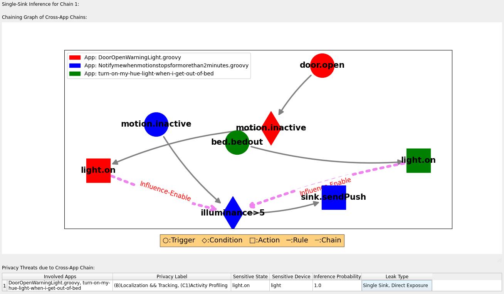

- [Description](#description)
  - [Security/Privacy Issues and Ethical Concerns](#securityprivacy-issues-and-ethical-concerns)
- [Basic Requirements](#basic-requirements)
  - [Hardware Requirements](#hardware-requirements)
  - [Software Requirements](#software-requirements)
  - [Estimated Time and Storage Consumption](#estimated-time-and-storage-consumption)
- [Environment](#environment)
  - [Accessibility](#accessibility)
  - [Set Up the Environment](#set-up-the-environment)
    - [Install Software](#install-software)
    - [Clone the PrivacyGuard Repository](#clone-the-privacyguard-repository)
    - [Change Directory](#change-directory)
    - [Allow All Connections to Docker Display](#allow-all-connections-to-docker-display)
    - [Build the Docker Image](#build-the-docker-image)
    - [Deploy a Docker Container](#deploy-a-docker-container)
    - [Download the Datasets](#download-the-datasets)
    - [Unzip the Datasets](#unzip-the-datasets)
  - [Testing the Environment](#testing-the-environment)
- [Artifact Evaluation](#artifact-evaluation)
  - [Main Results and Claims](#main-results-and-claims)
    - [Main Result 1: Device Profile Inference](#main-result-1-device-profile-inference)
    - [Main Result 2: Two-App Chains](#main-result-2-two-app-chains)
    - [Main Result 3: Average Number and Length of Chains](#main-result-3-average-number-and-length-of-chains)
    - [Main Result 4: Probability of Risky Chains](#main-result-4-probability-of-risky-chains)
    - [Main Result 5: Typical Sensitive Devices](#main-result-5-typical-sensitive-devices)
    - [Main Result 6: Average Number of Risky Chains with Different Privacy Threats](#main-result-6-average-number-of-risky-chains-with-different-privacy-threats)
    - [Main Result 7: Privacy Leakage Analysis](#main-result-7-privacy-leakage-analysis)
    - [Main Result 8: System Performance](#main-result-8-system-performance)
  - [Experiments](#experiments)
    - [Experiment 1: System Performance](#experiment-1-system-performance)
    - [Experiment 2: Correctness of PrivacyGuard](#experiment-2-correctness-of-privacyguard)
    - [Experiment 3: Cross-App Chains and their Patterns](#experiment-3-cross-app-chains-and-their-patterns)
    - [Experiment 4: Privacy Leakage Analysis](#experiment-4-privacy-leakage-analysis)
- [Limitations](#limitations)
- [Notes on Reusability](#notes-on-reusability)

Paper title: **PrivacyGuard: Exploring Hidden Cross-App Privacy Leakage Threats In IoT Apps**

Artifacts HotCRP Id: #14

Requested Badge: **Available**,**Functional**,**Reproduced**

## Description
The artifact contains all the Groovy code, Python code, datasets, and examples used in our paper, covering all the experiments and evaluations presented, allowing users to fully reproduce the findings and recreate the plots discussed in the paper.

### Security/Privacy Issues and Ethical Concerns
There are no Security/Privacy Issues and Ethical Concerns.

## Basic Requirements

### Hardware Requirements
No specific hardware required.

### Software Requirements
- macOS
  - [Docker](https://docs.docker.com/engine/install/)
  - [XQuartz](https://www.xquartz.org/)
- Linux
  - [Docker](https://docs.docker.com/engine/install/)
  - [Xhost](https://wiki.archlinux.org/title/Xhost)

### Estimated Time and Storage Consumption

- Estimated Time:
    - Experiment 1
        - 5.5 hours
    - Experiment 2
        - 0 seconds
    - Experiment 3
        - 1.5 hours
    - Experiment 4
        - 20 seconds

- Storage Consumption:
    - 1.5 GB

## Environment

### Accessibility

GitHub Repository: [https://github.com/PrivacyGuard-PETS/PrivacyGuard](https://github.com/PrivacyGuard-PETS/PrivacyGuard)

### Set Up the Environment

#### Install Software
- Install [Docker](https://docs.docker.com/engine/install/)
- X11 forwarding setup for GUI (The steps below only work on a local machine, not via SSH)
    - macOS
        - Install [XQuartz](https://www.xquartz.org/)
        - Configure XQuartz
            - After installing XQuartz, launch it and go to ``Preferences > Security``.
            - Check the option **Allow connections from network clients**.
            - Restart the computer, start XQuartz, type ``xclock`` in the terminal to see if an analog clock appears.
    - Linux
        - Ensure X11 is installed, and command ``xhost`` exists
        - if ``xhost`` not exists, install [Xhost](https://wiki.archlinux.org/title/Xhost), for example:
          ```bash
          # Arch Linux
          sudo pacman -S xorg-xhost

          # Ubuntu
          sudo apt install x11-xserver-utils
          ```
#### Clone the [PrivacyGuard](https://github.com/PrivacyGuard-PETS/PrivacyGuard) Repository
```bash
git clone https://github.com/PrivacyGuard-PETS/PrivacyGuard.git
```
#### Change Directory
```bash
cd PrivacyGuard
```

#### Allow All Connections to Docker Display
```bash
xhost +
```

#### Build the Docker Image
```bash
docker build -t privacy_guard Docker/
```

#### Deploy a Docker Container
- macOS
```bash

docker run -it -e DISPLAY=host.docker.internal:0 -v /tmp/.X11-unix:/tmp/.X11-unix:rw -v ${PWD}:/PrivacyGuard privacy_guard
```
- Linux
```bash
docker run -it -e DISPLAY=$DISPLAY -v /tmp/.X11-unix:/tmp/.X11-unix:rw -v ${PWD}:/PrivacyGuard privacy_guard
```
**IMPORTANT:** **ALL** steps below are to be executed within the running Docker container `privacy_guard` and inside the `PrivacyGuard` folder. If you successfully enter the container, the prompt should look like this (note that 69c9825a16d9 will be different for everyone, as it's the container ID):
```bash
root@69c9825a16d9:/PrivacyGuard#
```

#### Download the Datasets
```bash
wget "https://www.dropbox.com/scl/fi/yvfvjsg1dwu7j86lhligw/datasets.zip?rlkey=952yoyfqnqthe11yu5pus3fdi" -O datasets.zip
```

**Note:** You can also manually download [datasets.zip](https://www.dropbox.com/scl/fi/yvfvjsg1dwu7j86lhligw/datasets.zip?rlkey=952yoyfqnqthe11yu5pus3fdi&st=y0ubotp1&dl=0) and place it in the `PrivacyGuard` folder.

#### Unzip the Datasets
```bash
unzip datasets.zip
```

### Testing the Environment
```bash
python3 -m Python.artifacts.generate_examples
```

```bash
python3 -m Python.artifacts.privacy_leakage_analysis both
```

If everything is working correctly, you should be able to see the `PrivacyGuard` GUI application on the host machine. If the GUI is not visible, you'll need to set up X11 forwarding properly. However, even without X11 forwarding, you can still complete experiments 1 through 3, only experiment 4 requires the GUI.

## Artifact Evaluation

### Main Results and Claims

#### Main Result 1: Device Profile Inference
- We evaluated PrivacyGuard's performance in device profile inference by comparing the automated analysis results with the ground truth, finding the performance to be acceptable.
- Refer to **Section 6.1**, Paragraph **Device Profile Inference**, and **Table 5**
- See [Experiment 2: Correctness of PrivacyGuard](#experiment-2-correctness-of-privacyguard)

#### Main Result 2: Two-App Chains
- Using a large real-world dataset, we extracted TCA rules from the apps and constructed chains involving two apps each. We examined the likelihood of forming cross-app chains and observed interaction patterns that could aid in attack design. Among these chains, 15.40% involve sink apps, and 7.67% have the potential to leak at least one type of private data. The most common physical channels are *thermostat-temperature* and *light-illuminance*, while the most frequent device pairs are *light-light* and *switch-switch*.
- Refer to **Section 6.2**, Paragraph **Two-App Chains**.
- [Experiment 3: Cross-App Chains and their Patterns](#experiment-3-cross-app-chains-and-their-patterns)

#### Main Result 3: Average Number and Length of Chains
- The average number of chains increases linearly with the number of installed apps. Similarly, both the average and maximum length of the chains show a linear trend. If we include one fat app, the change to form the cross-app chain increases significantly.
- Refer to **Section 6.2**, Paragraph **Average Number and Length of Chains**, and **Figure 6**.
- [Experiment 3: Cross-App Chains and their Patterns](#experiment-3-cross-app-chains-and-their-patterns)

#### Main Result 4: Probability of Risky Chains
- The average probability of constructing at least one risky chain increases with the number of installed apps, e.g., from 3.28% with 5 apps to 20.97% with 30 apps. With fat apps, the probability rose to 5.60% with 5 apps and 30.06% with 30 apps.
- Refer to **Section 6.2**, Paragraph **Probability of Risky Chains**.
- [Experiment 3: Cross-App Chains and their Patterns](#experiment-3-cross-app-chains-and-their-patterns)

#### Main Result 5: Typical Sensitive Devices
- We reported the top-80% devices in each type through *direct exposure* and *implicit inference*, ordered by frequency. We found that most devices are associated with two privacy threats, *Localization && Tracking* and *Activity Profiling*. In contrast, the *Health Profiling* threat is associated with relatively fewer devices.
- Refer to **Section 6.2**, Paragraph **Typical Sensitive Devices**, and **Table 6**.
- [Experiment 3: Cross-App Chains and their Patterns](#experiment-3-cross-app-chains-and-their-patterns)

#### Main Result 6: Average Number of Risky Chains with Different Privacy Threats
- The fat app significantly increases the number of risky chains in all five privacy threat categories. The privacy leakage due to implicit inference are notably higher than that from direct exposure. A fat app is more likely to connect to other apps. This decreases the likelihood of a direct chain between two apps. It makes direct exposure more challenging but simplifies the implicit inference.
- Refer to **Section 6.2**, Paragraph **Average Number of Risky Chains with Different Privacy Threats**, and **Figure 7**.
- [Experiment 3: Cross-App Chains and their Patterns](#experiment-3-cross-app-chains-and-their-patterns)

#### Main Result 7: Privacy Leakage Analysis
- We present case studies using real-world IoT apps with typical devices.
- Refer to **Section 6.3 Privacy Leakage Analysis**, **Figure 5**, **Figure 8**, **Table 7** and **Table 8**.
- [Experiment 4: Privacy Leakage Analysis](#experiment-4-privacy-leakage-analysis)

#### Main Result 8: System Performance
- On average, processing takes 3,835.85 milliseconds per SmartApp, 0.23 milliseconds per IFTTT applet, and 225.54 milliseconds per OpenHAB rule. Calculation time averages about 7.00 milliseconds for 5 apps and 772.69 milliseconds for 30 apps.
- Refer to **Section 6.4 System Performance**.
- [Experiment 1: System Performance](#experiment-1-system-performance)

### Experiments

**IMPORTANT:** **Experiment 1** should be run first, as it generates all the necessary data. All experiments are conducted within the `PrivacyGuard` folder.

#### Experiment 1: System Performance
- Detailed Steps:
    ```bash
    python3 -m Python.artifacts.system_perfomance > Outputs/system_performance.log
    ```
    Read the generated log file ``Outputs/system_performance.log``
- Time Cost:
    - 5.5 hours
- Memory Usage:
    - 1.5 GB
- Expected Result:

    ```
    Processing Time (milliseconds):
    SmartThings: 3835.8500055012096 ms
    IFTTT: 0.23044734791955315 ms
    OpenHAB: 225.53611993866542 ms

    Calculation Time (milliseconds):
    From 5 to 30:
    [  6.99774494  29.51156298  95.5715676  196.18890626 435.1828244
    772.694113  ]

    Time cost: 5 Hours, 23 Minutes, 28 Seconds.
    Memory usage: 1312.71 MB
    ```
- Result or Claim:
  - [Main Result 8: System Performance](#main-result-8-system-performance)

#### Experiment 2: Correctness of PrivacyGuard
- Detailed Steps:
    ```bash
    python3 -m Python.artifacts.device_profile_inference > Outputs/device_profile_inference.log
    ```
    Read the generated log file ``Outputs/device_profile_inference.log``
- Time Cost:
    - 0 seconds
- Memory Usage:
    - 150 MB
- Expected Result:

    

    ```
    SmartThing Device Type Accuracy: 0.9662698412698413
    IFTTT Device Type Accuracy: 0.9297297297297298
    IFTTT Device State Accuracy: 0.9621621621621622
    OpenHab Device Type Accuracy: 0.91

    Time cost: 0 Seconds.
    Memory usage: 124.93 MB
    ```
- Result or Claim:
    - [Main Result 1: Device Profile Inference](#main-result-1-device-profile-inference)

#### Experiment 3: Cross-App Chains and their Patterns
- Detailed Steps:
    ```bash
    python3 -m Python.artifacts.cross_app_chains_patterns > Outputs/cross_app_chains_patterns.log
    ```
    Read the generated log file ``Outputs/cross_app_chains_patterns.log``
- Time Cost:
    - 1.5 hours
- Memory Usage:
    - 3 GB
- Expected Result:

    

    

    ```
    Number of Fat Apps for Each Type:
    {SmartThings: 104, OpenHAB: 1}

    Number of Clean Apps (without Fat Apps, without Empty Apps) for Each Type:
    {SmartThings: 1997, IFTTT: 2788, OpenHAB: 2085}
    Number of Clean Apps (without Fat Apps, without Empty Apps): 6870

    Number of Used Apps (with Fat Apps, without Empty Apps) for Each Type:
    {SmartThings: 2101, IFTTT: 2788, OpenHAB: 2086}
    Number of Used Apps (with Fat Apps, without Empty Apps): 6975

    Number of Actuactor Rules: 11720
    Number of Sink Rules: 2268
    Number of All Rules: 13988

    Connections:7458979
    Sinks:0.15399480277394534
    Sinks Leak:0.07666263707137398
    Activate:0.9543381205390175
    Enable:0.045661879460982525
    Match:0.6181260196603315
    Influence:0.38187398033966846

    Match Device Pairs: [(('light', 'light'), 1996078), (('switch', 'switch'), 1002934), (('thermostat', 'thermostat'), 843825), (('player', 'player'), 262932), (('door', 'door'), 212883), (('heater', 'heater'), 65971), (('lock', 'lock'), 53413), (('alarm', 'alarm'), 36256), (('button', 'button'), 33930), (('fan', 'fan'), 20408), (('tv', 'tv'), 14246), (('camera', 'camera'), 13504), (('activity', 'activity'), 7784), (('outlet', 'outlet'), 6447), (('conditioner', 'conditioner'), 5838), (('window', 'window'), 5675), (('clock', 'clock'), 4603), (('garage', 'garage'), 4414), (('cleaner', 'cleaner'), 3530), (('cooler', 'cooler'), 2820), (('phone', 'phone'), 2581), (('washer', 'washer'), 1548), (('battery', 'battery'), 1527), (('vent', 'vent'), 1263), (('sprinkler', 'sprinkler'), 1165), (('valve', 'valve'), 673), (('bed', 'bed'), 457), (('keypad', 'keypad'), 400), (('health', 'health'), 384), (('video', 'video'), 360), (('appliance', 'appliance'), 320), (('blind', 'blind'), 301), (('doorbell', 'doorbell'), 246), (('computer', 'computer'), 225), (('router', 'router'), 180), (('pump', 'pump'), 129), (('tag', 'tag'), 110), (('sleep', 'sleep'), 102), (('dryer', 'dryer'), 94), (('mower', 'mower'), 90), (('speaker', 'speaker'), 90), (('coffee', 'coffee'), 74), (('radio', 'radio'), 74), (('gate', 'gate'), 72), (('oven', 'oven'), 72), (('radiator', 'radiator'), 69), (('humidifier', 'humidifier'), 60), (('boiler', 'boiler'), 58), (('audio', 'audio'), 54), (('keyboard', 'keyboard'), 44), (('reminder', 'reminder'), 44), (('fireplace', 'fireplace'), 43), (('email', 'email'), 37), (('refrigerator', 'refrigerator'), 24), (('dishwasher', 'dishwasher'), 20), (('projector', 'projector'), 18), (('hub', 'hub'), 15), (('momentary', 'momentary'), 15), (('watch', 'watch'), 15), (('body', 'body'), 13), (('feeder', 'feeder'), 8), (('mailbox', 'mailbox'), 6), (('tone', 'tone'), 6), (('purifier', 'purifier'), 5), (('pressure', 'pressure'), 2), (('vacuum', 'vacuum'), 2), (('couch', 'couch'), 1), (('faucet', 'faucet'), 1), (('polling', 'polling'), 1)]
    Influence Physical Channels: [(('thermostat', 'temperature'), 654944), (('light', 'illuminance'), 524299), (('location', 'presence'), 251667), (('heater', 'temperature'), 229893), (('fan', 'motion'), 142197), (('door', 'motion'), 137815), (('fan', 'temperature'), 133202), (('heater', 'power'), 114821), (('window', 'motion'), 99243), (('heater', 'smoke'), 93251), (('conditioner', 'temperature'), 75443), (('cleaner', 'motion'), 70992), (('garage', 'motion'), 62161), (('cooler', 'temperature'), 51923), (('conditioner', 'power'), 36401), (('fan', 'humidity'), 30610), (('cooler', 'power'), 25798), (('blind', 'motion'), 14581), (('fireplace', 'temperature'), 11535), (('gate', 'motion'), 10128), (('vent', 'humidity'), 8054), (('valve', 'water'), 7478), (('heater', 'dioxide'), 6420), (('oven', 'temperature'), 6377), (('fireplace', 'power'), 5753), (('sprinkler', 'water'), 5718), (('heater', 'monoxide'), 5457), (('player', 'sound'), 4650), (('fireplace', 'smoke'), 4646), (('tv', 'sound'), 3312), (('oven', 'power'), 3211), (('alarm', 'sound'), 3024), (('oven', 'smoke'), 2610), (('humidifier', 'humidity'), 2225), (('purifier', 'smoke'), 1740), (('curtain', 'motion'), 1638), (('heater', 'gas'), 1605), (('dehumidifier', 'humidity'), 938), (('conditioner', 'gas'), 510), (('cooler', 'gas'), 360), (('fireplace', 'dioxide'), 320), (('fireplace', 'monoxide'), 272), (('sprayer', 'water'), 261), (('oven', 'dioxide'), 180), (('oven', 'monoxide'), 153), (('speaker', 'sound'), 144), (('purifier', 'dioxide'), 120), (('purifier', 'monoxide'), 102), (('faucet', 'water'), 83), (('fireplace', 'gas'), 80), (('oven', 'gas'), 45)]

    Probability of Risky Chains:
    Without Fat:
    [0.03284391 0.05233883 0.09110091 0.13447719 0.16882108 0.20974318]
    With Fat:
    [0.05595561 0.12774438 0.18608912 0.23460691 0.26839296 0.30064297]


    {Single Sink, Direct Exposure: {'Identification': [('audio', 169), ('camera', 98), ('video', 8)], 'Localization && Tracking': [('location', 58417), ('door', 31088), ('lock', 18339), ('presence', 11888), ('fan', 9728), ('cooler', 8702), ('heater', 8005), ('window', 6057), ('player', 4788), ('conditioner', 2869), ('light', 2539), ('garage', 2430), ('fireplace', 1914), ('cleaner', 1905), ('blind', 1099), ('oven', 1005), ('gate', 884), ('curtain', 749), ('car', 476), ('vacuum', 461), ('faucet', 198), ('audio', 169), ('activity', 140), ('camera', 98), ('bed', 90), ('washer', 78), ('sleep', 77), ('tv', 74), ('speaker', 22), ('cooktop', 18), ('dryer', 11), ('refrigerator', 9), ('video', 8), ('kettle', 6), ('geolocation', 1)], 'Activity Profiling': [('fan', 9728), ('cooler', 8702), ('heater', 8005), ('player', 4788), ('conditioner', 2869), ('light', 2539), ('fireplace', 1914), ('cleaner', 1905), ('blind', 1099), ('oven', 1005), ('curtain', 749), ('car', 476), ('vacuum', 461), ('faucet', 198), ('audio', 169), ('activity', 140), ('camera', 98), ('bed', 90), ('washer', 78), ('sleep', 77), ('tv', 74), ('speaker', 22), ('cooktop', 18), ('dryer', 11), ('refrigerator', 9), ('video', 8), ('kettle', 6)], 'Health Profiling': [('watch', 135), ('health', 70), ('wristband', 16)], 'Lifecycle Transitions': [('audio', 169), ('camera', 98), ('health', 70), ('video', 8), ('geolocation', 1)]}, Single Sink, Implicit Inference: {'Identification': [('audio', 49), ('camera', 13), ('video', 1)], 'Localization && Tracking': [('location', 26211), ('door', 13504), ('lock', 4753), ('presence', 4137), ('cooler', 3973), ('fan', 3961), ('window', 3027), ('heater', 2508), ('player', 1417), ('light', 1377), ('conditioner', 980), ('garage', 921), ('fireplace', 417), ('car', 407), ('blind', 313), ('cleaner', 239), ('gate', 146), ('oven', 113), ('curtain', 62), ('audio', 49), ('bed', 38), ('vacuum', 28), ('activity', 18), ('camera', 13), ('tv', 12), ('speaker', 9), ('cooktop', 7), ('washer', 5), ('sleep', 4), ('faucet', 1), ('geolocation', 1), ('kettle', 1), ('video', 1)], 'Activity Profiling': [('cooler', 3973), ('fan', 3961), ('heater', 2508), ('player', 1417), ('light', 1377), ('conditioner', 980), ('fireplace', 417), ('car', 407), ('blind', 313), ('cleaner', 239), ('oven', 113), ('curtain', 62), ('audio', 49), ('bed', 38), ('vacuum', 28), ('activity', 18), ('camera', 13), ('tv', 12), ('speaker', 9), ('cooktop', 7), ('washer', 5), ('sleep', 4), ('faucet', 1), ('kettle', 1), ('video', 1)], 'Health Profiling': [('watch', 18), ('health', 14), ('wristband', 1)], 'Lifecycle Transitions': [('audio', 49), ('health', 14), ('camera', 13), ('geolocation', 1), ('video', 1)]}}

    Top 80% Typical Sensitive Devices:
    {
        "Single Sink, Direct Exposure": {
            "Identification": [
                "audio",
                "camera",
                "video"
            ],
            "Localization && Tracking": [
                "location",
                "door",
                "lock",
                "presence",
                "fan",
                "cooler",
                "heater"
            ],
            "Activity Profiling": [
                "fan",
                "cooler",
                "heater",
                "player",
                "conditioner",
                "light"
            ],
            "Health Profiling": [
                "watch",
                "health",
                "wristband"
            ],
            "Lifecycle Transitions": [
                "audio",
                "camera",
                "health"
            ]
        },
        "Single Sink, Implicit Inference": {
            "Identification": [
                "audio",
                "camera",
                "video"
            ],
            "Localization && Tracking": [
                "location",
                "door",
                "lock",
                "presence",
                "cooler",
                "fan"
            ],
            "Activity Profiling": [
                "cooler",
                "fan",
                "heater",
                "player",
                "light"
            ],
            "Health Profiling": [
                "watch",
                "health",
                "wristband"
            ],
            "Lifecycle Transitions": [
                "audio",
                "health"
            ]
        }
    }

    Time cost: 1 Hours, 3 Minutes, 48 Seconds.
    Memory usage: 2764.28 MB
    ```
- Result or Claim:
    - [Main Result 2: Two-App Chains](#main-result-2-two-app-chains)
    - [Main Result 3: Average Number and Length of Chains](#main-result-3-average-number-and-length-of-chains)
    - [Main Result 4: Probability of Risky Chains](#main-result-4-probability-of-risky-chains)
    - [Main Result 5: Typical Sensitive Devices](#main-result-5-typical-sensitive-devices)
    - [Main Result 6: Average Number of Risky Chains with Different Privacy Threats](#main-result-6-average-number-of-risky-chains-with-different-privacy-threats)

#### Experiment 4: Privacy Leakage Analysis
- Detailed Steps:
    ```bash
    python3 -m Python.artifacts.generate_examples
    ```

    ```bash
    # Figure 8(a); Case L1 and L2 of Table 8
    python3 -m Python.artifacts.privacy_leakage_analysis original
    ```

    ```bash
    # Figure 8(b); Case L3 of Table 8
    python3 -m Python.artifacts.privacy_leakage_analysis malicious1
    ```

    ```bash
    # Figure 8(c); Case L4 of Table 8
    python3 -m Python.artifacts.privacy_leakage_analysis malicious2
    ```

    ```bash
    # Figure 8(d); Case L5 of Table 8
    python3 -m Python.artifacts.privacy_leakage_analysis malicious3
    ```

- Time Cost:
    - 20 seconds
- Memory Usage:
    - 300 MB
- Expected Result:
    - Original (Figure 8(a); Case L1 and L2 of Table 8)

        - Input Apps

            

        - Cross-App Chains with Privacy Risk

            

        - Single-Sink Inference for Chain 1

            

        - Multiple-Sink Inference for Group 1

            

    - Malicious 1 (Figure 8(b); Case L3 of Table 8)

        - Input Apps

            

        - Cross-App Chains with Privacy Risk

            

        - Single-Sink Inference for Chain 1

            

        - Single-Sink Inference for Chain 2

            

    - Malicious 2 (Figure 8(c); Case L4 of Table 8)

        - Input Apps

            

        - Cross-App Chains with Privacy Risk

            

        - Single-Sink Inference for Chain 1

            

    - Malicious 3 (Figure 8(d); Case L5 of Table 8)

        - Input Apps

            

        - Cross-App Chains with Privacy Risk

            

        - Single-Sink Inference for Chain 1

            

- Result or Claim:
  - [Main Result 7: Privacy Leakage Analysis](#main-result-7-privacy-leakage-analysis)

## Limitations
Since the IoT apps used in the experiments are randomly selected from the dataset, the results may vary slightly.

## Notes on Reusability
Our framework can be used as a general tool for analyzing SmartApps, IFTTT applets, and OpenHAB rules. It can also be applied to identify cross-app chaining.
